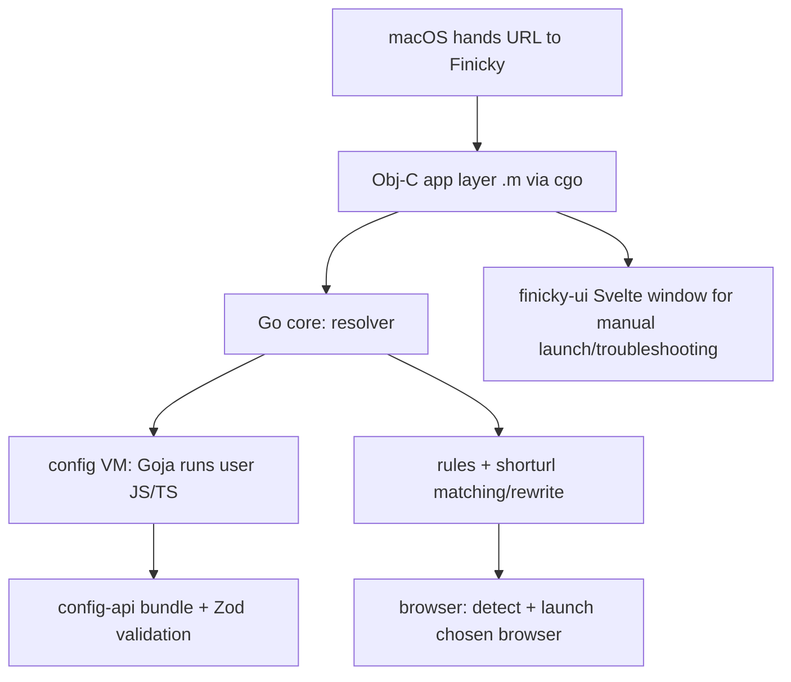

# Architecture & Technical Stack

This document gives contributors a fast, high-level map of how Finicky is built so
you can find your way around the repository quickly. For step-by-step build
instructions, see the wiki page
[Building Finicky from source](https://github.com/johnste/finicky/wiki/Building-Finicky-from-source).

## What Finicky is

Finicky is a native **macOS** application that registers itself as the system
default browser. When you click a link anywhere on macOS, the OS hands the URL to
Finicky, which evaluates your JavaScript/TypeScript configuration and opens the
"right" browser (optionally rewriting the URL first).

The whole thing ships as a single self-contained `.app` — there is no Node.js
runtime requirement on the user's machine. User config is executed inside an
embedded JavaScript engine compiled into the Go binary.

## Repository layout

```
apps/
  finicky/            The macOS application (Go + Objective-C, cgo)
  browser-addon/      Chrome/Firefox extension ("Open with Finicky")
packages/
  config-api/         TypeScript config API + type definitions (bundled into the app)
  finicky-ui/         Svelte web UI shown in the app window (bundled into the app)
example-config/       Example user configs (example.js / example.ts)
scripts/              Build / dev / test / release shell scripts
testdata/             Sample config.js and rules.json for local dev scenarios
docs/                 This document
```

## Languages & tooling at a glance

| Area                | Stack                                                                 |
| ------------------- | --------------------------------------------------------------------- |
| macOS app core      | **Go 1.24** with **cgo** bridging to **Objective-C** (Cocoa/AppKit)   |
| JS config execution | **Goja** (pure-Go JS engine) + **goja-babel** + **esbuild** (Go pkg)  |
| Config API          | **TypeScript**, bundled with **esbuild**, validated with **Zod**      |
| App window UI       | **Svelte 5** + **Vite 6** + **TypeScript**, routed via `svelte-routing` |
| Browser extension   | **JavaScript**, MV3 (Chrome) / MV2-style (Firefox) manifests          |
| Tests               | **Go `testing`** (app core), **Vitest** (config-api)                  |
| Build orchestration | **Bash** scripts in `scripts/`                                        |
| CI                  | **GitHub Actions** (`.github/workflows/macos-build.yml`)              |
| Packaging           | Universal binary via `lipo`; signing/notarization via **gon**        |

## The macOS app — `apps/finicky/src`

The app is written in Go, with the macOS-specific UI/system glue written in
Objective-C and called through cgo. Files come in matched sets, e.g.
[browser.go](../apps/finicky/src/browser.go) /
[browser.h](../apps/finicky/src/browser.h) /
[browser.m](../apps/finicky/src/browser.m), where the `.go` file declares the cgo
bridge and the `.m` file holds the native Cocoa implementation.

Entry point: [main.go](../apps/finicky/src/main.go) (paired with `main.h`/`main.m`).

### Go dependencies ([go.mod](../apps/finicky/src/go.mod))

- `github.com/dop251/goja` — JavaScript engine (runs user config without Node).
- `github.com/jvatic/goja-babel` — Babel inside Goja, so modern JS/TS syntax works.
- `github.com/evanw/esbuild` — used as a Go library to transform/bundle config.
- `github.com/fsnotify/fsnotify` — watch the user config file for changes.
- `github.com/Masterminds/semver` — version comparisons (e.g. update checks).
- `al.essio.dev/pkg/shellescape` — safe shell argument escaping when launching browsers.

### Subpackages

| Package    | Responsibility                                                                 |
| ---------- | ------------------------------------------------------------------------------ |
| `config`   | Loads and runs user config. [vm.go](../apps/finicky/src/config/vm.go) drives the Goja VM; also `cache.go`, `configfiles.go`, `console.go`. |
| `resolver` | Core URL resolution pipeline — given a URL, decide the browser. (`resolver.go`) |
| `rules`    | Matching/rewrite rule evaluation. (`rules.go`)                                 |
| `browser`  | Browser detection and launching. `browsers.json`, `detect.go`, `launcher.go`.  |
| `shorturl` | Expands short/redirect URLs. `resolver.go`, `shortener_domains.json`.          |
| `window`   | Native app window (Go + Obj-C). `window.go`/`.h`/`.m`.                          |
| `util`     | Directory helpers and macOS app info via Obj-C. `directories.go`, `info.*`.    |
| `logger`   | Application logging. `logger.go`.                                               |
| `version`  | Version metadata; `commitHash`/`buildDate`/`apiHost` are injected at build time via `-ldflags`. |
| `assets`   | Embeds the built UI + config API into the binary (see below).                  |

### How web assets get into the binary

[assets/assets.go](../apps/finicky/src/assets/assets.go) uses Go's `//go:embed
templates/*` to compile the built Svelte UI directly into the executable. The
build script copies artifacts into `apps/finicky/src/assets/` before `go build`:

- `packages/config-api/dist/finickyConfigAPI.js` → `assets/finickyConfigAPI.js`
  (the JS API surface that user configs run against, loaded into Goja).
- `packages/finicky-ui/dist/*` → `assets/templates/` (the embedded UI).

## Config API — `packages/config-api`

TypeScript package that defines the public configuration API and the generated
`finicky.d.ts` types users get for autocompletion.

- Build: `esbuild` bundles `src/index.ts` into a single IIFE
  (`dist/finickyConfigAPI.js`, global `finickyConfigAPI`, target `es2015`) so it
  can be evaluated inside Goja.
- Validation: **Zod** (`configSchema.ts`) + `zod-validation-error`. Types are
  generated from the Zod schema via `@duplojs/zod-to-typescript`
  (`scripts/generate-typedefs.ts`).
- Tests: **Vitest** (e.g. `config.test.ts`, `FinickyURL.test.ts`, `wildcard.test.ts`).

This package is consumed by the Go app at build time (bundled + embedded), not at
runtime as an npm dependency.

## App UI — `packages/finicky-ui`

The window shown when you launch Finicky manually (start page, rules viewer, log
viewer, test-URL tool, about).

- **Svelte 5** components/pages under `src/components` and `src/pages`.
- **Vite 6** build, **TypeScript**, `svelte-routing` for navigation.
- `svelte-check` for type checking.
- Built output (`dist/`) is copied into `assets/templates/` and embedded in the Go
  binary.

> Note: the package declares `pnpm` as its `packageManager`, but the build/CI
> scripts currently install and build with **npm** (`package-lock.json` is the
> lockfile used in CI).

## Browser extension — `apps/browser-addon`

A small WebExtension that adds an "Open with Finicky" action and lets alt-click
open a link via Finicky. Separate manifests for each browser
(`manifest-chrome.json`, `manifest-firefox.json`) with `background.js` and
`contentScript.js`; `build.sh` packages it.

## Build pipeline — `scripts/`

The build is orchestrated by Bash. The key scripts:

- [install.sh](../scripts/install.sh) — installs npm deps for both TS packages.
- [build.sh](../scripts/build.sh) — the main pipeline:
  1. Build `config-api` (esbuild + type generation), copy bundle into the Go assets.
  2. Build `finicky-ui` (Vite), copy `dist/*` into `assets/templates/`.
  3. `go build` the app with cgo for the target arch(es), injecting version
     metadata via `-ldflags`.
  4. Assemble the `.app` bundle and copy `finicky.d.ts` + `Contents/` assets.
  - Modes: `BUILD_UNIVERSAL=1` builds **arm64 + amd64** and merges them with
    `lipo` into a universal binary; `BUILD_TARGET_ARCH` builds a single arch;
    otherwise it does a **local native-arch** build and installs to
    `/Applications/Finicky.app`.
- [dev.sh](../scripts/dev.sh) — runs the already-built app in different config
  scenarios (no config, JS only, rules.json only, both) without rebuilding, using
  `testdata/`. Supports `FINICKY_MOCK_UPDATE` to preview the update banner.
- [test.sh](../scripts/test.sh) — runs `go test ./...` for the app core.
- [watch.sh](../scripts/watch.sh) / [watch-run.sh](../scripts/watch-run.sh) —
  rebuild/run on change during development.
- [release.sh](../scripts/release.sh) + [gon-config.json](../scripts/gon-config.json)
  — codesigning and notarization via gon.

## Continuous integration

[.github/workflows/macos-build.yml](../.github/workflows/macos-build.yml) runs on
`macos-latest`:

1. **build-macos** — sets up Node 22 + Go 1.24, runs `install.sh`, then
   `BUILD_UNIVERSAL=1 build.sh`, and uploads `Finicky-universal.tar.gz`.
2. **sign-and-notarize** — on `main` push / manual dispatch, signs and notarizes
   the universal app.

(There is also a legacy `nodejs.yml` workflow targeting the old `config-api`
layout/branches.)

## End-to-end flow (clicking a link)



## Where to start as a contributor

- Changing URL matching/rewriting logic → `apps/finicky/src/rules`,
  `apps/finicky/src/resolver`, and the `config-api` schema.
- Changing the config API surface or types → `packages/config-api/src`.
- Changing the app window UI → `packages/finicky-ui/src`.
- Native macOS behavior (window, launching, app info) → the `.m`/`.h` files in
  `apps/finicky/src` and its `window`/`util` packages.
